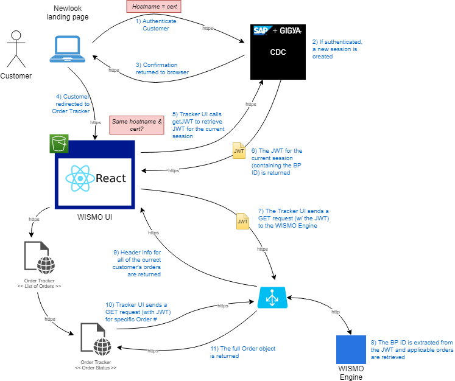

# Authentication

The application provides access to both authenticated and unauthenticated users but their experience (i.e. what they can do) is very different. The following topics describe how authentication works, what each user can access and how to simulate authentication is your local environment.

## Authentication Flow

In Production, customers are authenticated within the newlook.dteenergy.com website (S3 owns this). Access to the tracker application is achieved using a form of Single Sign-On (SSO).

### How Customer Are Authenticated

1. To sign-in, customers are directed to the Unified Login Page within the Newlook DTE Energy website.

2. The Unified Login Page submits the credentials entered by the customer to SAP Gigya which acts as the Identity Provider and validates the credentials.

3. If successful, Gigya creates an SSO session and returns confirmation to the Unified Login Page.

### How the Tracker Uses Authentication

When a customer browses to the Tracker application, the following steps occur:

1. Regardless of the target URL, the `AuthProvider` intercepts the requests and initiates authentication (using the `authenticate` function located in the `/security` folder). A loading indicator is shown in the UI while authenticating.

2. The `authenticate` function uses the Gigya Web SDK (loaded as a script in the `index.html` file) to request a JSON Web Token (JWT) from Gigya. If an SSO session was established, as described above, a token representing the current, authenticated customer is returned. If no SSO session was established, meaning the user is not signed-in, the request fails.

3. If a JWT is returned,

   1. The `AuthProvider` holds the token in its internal state so the token may be passed in the `Authorize` header of all API requests.
   2. The `isAuthenticated` flag is set to `true` so other code may perform checks to determine if the current customer is authenticated or not.
   3. The loading indicator is removed and processing continued.

4. Otherwise,
   1. The `isAuthenticated` flag is set to `false`
   2. The loading indicator removed
   3. The request continues to be processed as it normally would



### Securing Access to Specific Features/Pages

To prevent access to specific features/pages by unauthenticated users, the `ProtectedRoute` component checks the current state, using the `useAuth` hook, and only allows navigation to the specified route if the current user has been authenticated. By default, unauthenticated users are redirected to the application's `Home` page which performs the same check to determine what page should be displayed to the user.

### Authenticated Users

Authenticated users have access to nearly all of the application's features.

#### Browsing to the Tracker

When an authenticated customer is directed to the root URL of the application, '/', the `Home` page will redirect them to the `Summary` page which immediately attempts to retrieve the list of open orders for that customer. If there are more than one, the `Summary` page renders the list so the customer can select which order to track. On the other hand, if the customer only has one open order, the `Summary` page will automatically redirect the user right to the `OrderStatus` page for that order.

#### Deep Linking

In some cases, an authenticated customer may navigate directly to one of the application's pages, such as the `OrderStatus` page for a specific order. As long as they are properly authenticated, routing will allow such direct access.

### Unauthenticated Users

Unauthenticated users are restricted to accessing the `Search` and `OrderStatus` page.

#### Browsing to the Tracker

When an unauthenticated user browses to the application, they are redirected to the "Guest Order Tracker Login Page" (`Search` page) where they must enter their account name and order number as well as answer a CAPTCHA challenge to locate the requested order. If the order is found, they are automatically redirected to the `OrderStatus` page.

#### Deep Linking

When an unauthenticated user navigates directly to the `OrderStatus` page using an emailed link, they are redirected to the `Search` page with the account name and order number are populated from the link URL. Only after they answer the CAPTCHA challenge will they be able to view the requested order.

## Local Authentication

Unfortunately, the authentication flow with SAP Gigya requires all requests for JWTs to come from systems/applications hosted on the dteenergy.com domain (or subdomain). To let developers run the application as an authenticated user, several features have been implemented in the application when run locally on a developer's machine.

### Logging In

A static `login.html` page has been implemented under the `/public` folder that contains all of the code necessary to sign-in a user and create a Single Sign-On (SSO) session.

To log into the application as a test user:

1. Navigate directly to the login page using the following URL:

   ```
   https://dev.orderstatus.dteenergy.com/login.html
   ```

   Be sure to include the `.html` extension otherwise React routing will intercept the request and the Not Found page will be shown.

2. Enter the test user credentials and click the **Login** button.

3. If successful, the browser will be automatically redirected to the `Home` page per the flow described under [Authenticated Users](#authenticated-users).

### Logging Out

Similar to logging in, a static `logout.html` page was created with all of the code necessary to sign-out the current user and end the SSO session.

To log out the current users:

1. Navigate directly to the logout page using the following URL:

   ```
   https://dev.orderstatus.dteenergy.com/logout.html
   ```

   Be sure to include the `.html` extension otherwise React routing will intercept the request and the Not Found page will be shown.

2. Click the **Logout** button.

3. If successful, the browser will be automatically redirected to the `Login.html` page.

### Developer Toolbar

To facilitate signing in and out different users to exercise the application through different scenarios, buttons have been added to the developer toolbar (appearing just below the DTE header when running locally).

- If the current user has already authenticated, the **Logout** button will appear browsing to the `logout.html` page when clicked.
- If the current user is not authenticated, the **Login** button will appear browsing to the `login.html` page when clicked.
